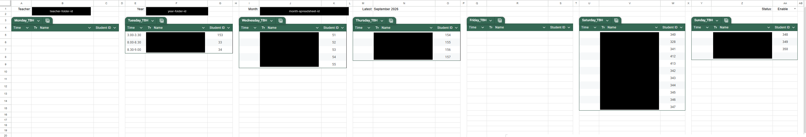
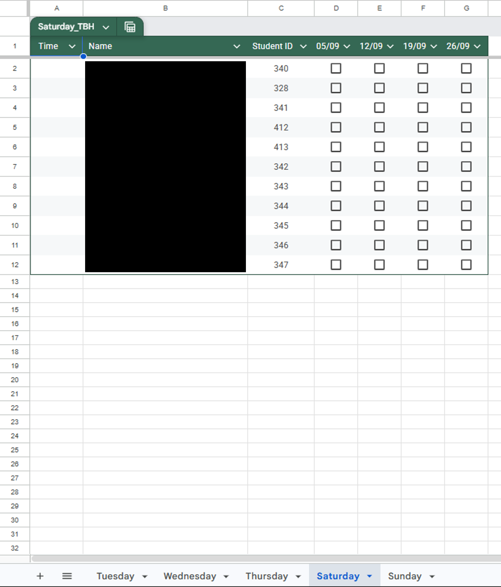
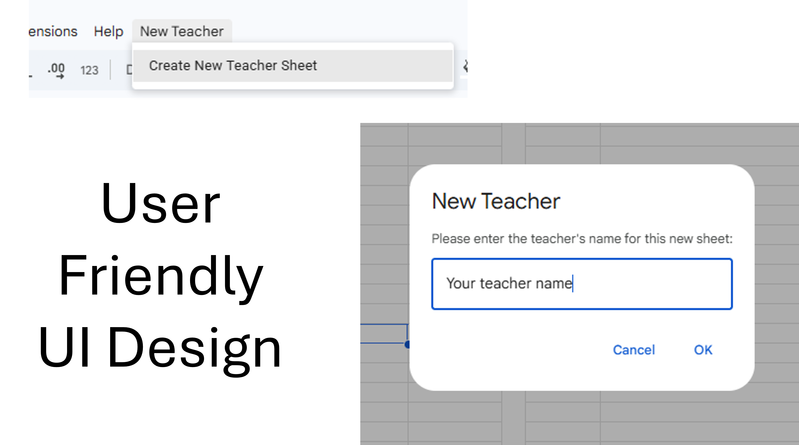

# Hikvision Automated Attendance System

An end-to-end automated attendance tracking system integrating **Hikvision Access Control Terminal Devices**, a **Node.js / Express Middleware Listener**, and **Google Apps Script (GAS) with Google Sheets & Drive API**.

This system captures real-time scan/event logs from Hikvision facial recognition / card terminal devices, buffers the student IDs locally, and periodically flushes attendance entries into teacher-specific monthly Google Sheets dynamically organized inside Google Drive folders.

Developed and deployed specifically for **Jazz Yamaha Music School (Yamaha Music School, Melaka, Malaysia)**.

---

## Features

- **Real-Time Hikvision Integration**: Listens for HTTP POST events (`multipart/form-data`, JSON, XML) sent by Hikvision Access Controller devices.
- **Fault-Tolerant Buffering**:
  - Buffers unique student IDs locally in memory and persists them to `buffer.json`.
  - Automatic flushing to Google Sheets at regular intervals (default: 1 minute).
  - Graceful shutdown handling (`SIGINT`/`SIGTERM`) ensuring pending scans are flushed prior to process exit.
- **Dynamic Google Sheets & Drive Management**:
  - **Auto-Provisioning**: Automated creation of Teacher Folders (Root Drive), Year Folders, and Month Spreadsheets based on active schedules.
  - **Dynamic Timetable Sheet Creation**: Generates daily attendance tabs (Monday–Sunday) with interactive checkbox grids, structured tables, custom column widths, and protection rules.
  - **Optimized Caching & Locking**: Uses Apps Script `CacheService` and `LockService` to prevent race conditions during concurrent API updates.
- **Windows Service Ready**: Configured for continuous background execution as a Windows Service using NSSM (Non-Sucking Service Manager).

---

## Repository Structure

```text
hikvision-attendance-system/
├── backend/
│   ├── server.js              # Node.js Express server handling Hikvision HTTP events
│   ├── mock-device.js         # Mock client script to simulate Hikvision device events
│   ├── package.json           # Node.js backend dependencies
│   ├── buffer.json            # Local persistent buffer file (auto-generated)
│   └── attendance.log         # Service execution log file (auto-generated)
├── apps-script/
│   ├── appsscript.json        # Google Apps Script manifest (OAuth scopes & V8 runtime)
│   ├── generateAttendance.gs  # Batch automation engine for Drive folders & Sheets creation
│   ├── recordAttendance.gs    # Web App endpoint handling POST requests from Express listener
│   └── SheetSetup.gs          # Custom Google Sheets menu & interactive UI functions
└── README.md                  # Main project documentation
```

---

## Generated Attendance Structure

```text
Google Drive Root /
├── [Config Sheet]                                # Configuration file
└── [Teacher Name] /                              # Teacher Folder
    └── [Year] /                                  # Year Folder (e.g., 2026)
        └── [Month Year] Attendance Record        # Monthly Spreadsheet (e.g., March 2026 Attendance)
            ├── Monday                            # Daily Timetable Tab
            ├── Tuesday
            ├── Wednesday
            ├── Thursday
            ├── Friday
            ├── Saturday
            └── Sunday
```

---

### Example of Config Sheet



---

### Example of Generated Monthly Sheet



---

### Simple to Add New Teacher



---

## System Architecture & Workflow

```text
+-----------------------+      HTTP POST      +------------------------+
| Hikvision Access      | ------------------> | Node.js Express Server |
| Controller Terminal   | (JSON/XML Multipart)| (Listener on Port 3000)|
+-----------------------+                     +------------------------+
                                                          |
                                                    Local Buffer
                                                    (buffer.json)
                                                          |
                                                  Flush Interval / Exit
                                                          v
+-----------------------+      HTTP POST      +------------------------+
| Google Sheets         | <------------------ | Google Apps Script     |
| Attendance Records    |   Sheets & Drive    | Web App Exec API       |
+-----------------------+        APIs         +------------------------+
```

---

## Module Overview

### 1. Backend Listener (`backend/server.js`)
- Runs an Express server listening on port `3000`.
- Processes incoming multipart payloads from Hikvision terminal devices.
- Extracts `employeeNoString` / `employeeNo` from either JSON or XML event bodies.
- Buffers unique IDs into `buffer.json` and flushes them to Google Apps Script Web App using `axios`.

### 2. Google Apps Script Framework (`apps-script/`)
- **`appsscript.json`**: Manifest declaring required OAuth permissions (`spreadsheets`, `drive`, `script.external_request`) and V8 runtime configuration.
- **`generateAttendance.gs`**: Main automation logic for parsing master configuration sheets, creating missing teacher folders, year folders, monthly attendance spreadsheets, and weekly tables with checkboxes.
- **`recordAttendance.gs`**: Handles `doPost(e)` endpoints called by the Node.js backend. Parses incoming `student_ids`, matches them against current-day timetables, and marks attendance checkboxes as `TRUE`.
- **`SheetSetup.gs`**: Provides a custom UI menu inside the Google Sheet (`New Teacher -> Create New Teacher Sheet`) to automatically build structured schedule tables for newly added teaching staff.

---

## Setup & Installation Guide
> ⚠️ **IMPORTANT COMMERCIAL USE WARNING & PROPRIETARY NOTICE**
> 
> **THIS SOFTWARE IS PROPRIETARY AND UNLICENSED FOR PUBLIC OR COMMERCIAL USE.**
> 
> This codebase was created exclusively for **Jazz Yamaha Music School (Yamaha Music School, Melaka, Malaysia)**. 
> 
> - **Commercial Prohibition**: You are **STRICTLY PROHIBITED** from using, deploying, distributing, or commercializing this software or any portion of its codebase in any external commercial, enterprise, or business environment.
> - **Reference & Educational Purpose Only**: Any public visibility of this repository is provided strictly for technical demonstration, portfolio review, and educational reference by the developer. No license or grant of rights is conveyed.
> - **No Warranty / Support**: The author and copyright holder accept no liability or responsibility for unauthorized deployment or usage.

---
### Prerequisites
- **Node.js** (v16.0.0 or higher)
- **Google Cloud Platform / Apps Script** deployment privileges
- **Hikvision SADP Tool** (for device network configuration)
- **NSSM** (for running listener as a service on Windows)

---

### Step 1: Deploy Google Apps Script

1. Open your master Configuration Google Sheet.
2. Navigate to **Extensions > Apps Script**.
3. Create the script files matching the `apps-script/` folder content (`appsscript.json`, `generateAttendance.gs`, `recordAttendance.gs`, `SheetSetup.gs`).
4. Copy the **Google Sheets ID** and **Google Drive Root Folder ID** and replace `YOUR_CONFIG_SPREADSHEET_ID` and `YOUR_ROOT_FOLDER_ID` in `generateAttendace.gs` and `recordAttendace.gs`.
5. Ensure Advanced Services (**Sheets API v4**, **Drive API v3**) are enabled in the Apps Script project.
6. Deploy as a Web App:
   - **Execute as**: `User deploying the web app`
   - **Who has access**: `Anyone`
7. Copy the resulting **Web App URL** and replace `APPS_SCRIPT_URL` in `backend/server.js`.
8. In Apps Script, go to Triggers (alarm clock icon) and click Add Trigger: select generateAttendance as the function to run, set the event source to Time-driven, choose Month timer, and set it to execute on the 1st day of the month between midnight and 1:00 AM.

---

### Step 2: Configure Node.js Middleware

1. Navigate to the backend directory:
   ```bash
   cd backend
   ```
2. Install dependencies:
   ```bash
   npm install
   ```
3. Start the server:
   ```bash
   node start
   ```

---

### Step 3: Configure Hikvision Terminal Device

1. Open **SADP Tool** to obtain the terminal's IP address.
2. Log into the Hikvision Web Management Portal in your browser.
3. Navigate to **System > System Configuration > Event HTTP Listening** (or *Net HTTP Listening*).
4. Run `ipconfig` on the host PC running the Node.js server to get its local IPv4 address.
5. Enter the PC's IP address and Port (`3000`) into the Hikvision Event Alarm Server settings and click **Save**.

---

### Step 4: Running as a Windows Service (NSSM)

To ensure the listener runs continuously in production without requiring an active terminal session:

1. Download [NSSM (Non-Sucking Service Manager)](https://nssm.cc/).
2. Copy `nssm.exe` into your backend folder.
3. Open CMD as Administrator and run:
   ```cmd
   cd C:\path\to\backend
   nssm install HikvisionListener "C:\Program Files\nodejs\node.exe" "server.js"
   nssm set HikvisionListener AppDirectory "C:\path\to\backend"
   nssm set HikvisionListener AppStopMethodSkip 0
   nssm set HikvisionListener AppStopMethodConsole 6000
   nssm set HikvisionListener AppStopMethodWindow 6000
   nssm start HikvisionListener
   ```
4. Check service status:
   ```cmd
   nssm status HikvisionListener
   ```

---

## Testing with Mock Device

You can test the backend pipeline without a physical device using `mock-device.js`:

```bash
node backend/mock-device.js
```

This script sends simulated Hikvision `AccessControllerEvent` payloads (JSON/XML) to `http://localhost:3000/device/events` every few seconds.

---

## License & Usage Restrictions

**UNLICENSED / PROPRIETARY**

Copyright (c) **Jazz Yamaha Music School (Yamaha Music School, Melaka, Malaysia)**. All rights reserved.

This software is a proprietary commercial product developed specifically for and owned by **Jazz Yamaha Music School (Yamaha Music School, Melaka)**. 

- **No Permission Granted**: Unauthorized copying, modification, distribution, sublicensing, or deployment of this software, via any medium, is strictly prohibited.
- **Commercial Usage**: This project is private, closed-source software intended exclusively for internal operations at Jazz Yamaha Music School.
